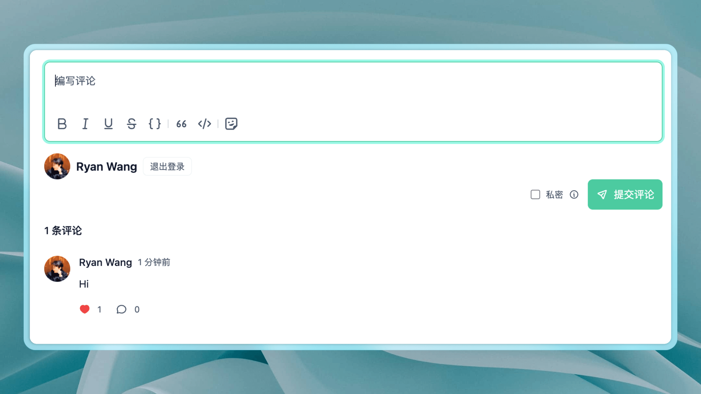

# plugin-comment-widget

Halo 2.0 的通用评论组件插件，为前台提供完整的评论解决方案。

## 功能特性

- 支持评论和回复，可分别配置分页条数
- 支持私密评论，限制评论内容的可见范围
- 支持表情选择，可自定义评论框占位符
- 支持上传 JPEG、PNG、GIF、WebP、AVIF 图片，可配置文件大小限制、存储策略和匿名上传权限
- 支持评论草稿保存
- 支持字母数字验证码、算术验证码、Cloudflare Turnstile 和 ALTCHA 验证
- 可针对所有用户、匿名用户或指定角色启用验证，ALTCHA 支持手动和自动验证模式
- 支持 Gravatar 头像，可自定义头像服务镜像地址和适用用户范围
- 支持显示评论者设备信息
- 支持通过 CSS 变量自定义样式，适配明亮和暗黑模式

## 使用方式

1. 下载，目前提供以下两个下载方式：
    - GitHub Releases：访问 [Releases](https://github.com/halo-dev/plugin-comment-widget/releases) 下载 Assets 中的 JAR 文件。
    - Halo 应用市场：<https://www.halo.run/store/apps/app-YXyaD>。
2. 安装，插件安装和更新方式可参考：<https://docs.halo.run/user-guide/plugins>。

> 需要注意的是，此插件需要主题进行适配，不会主动在内容页加载评论组件。

## 主题适配

主题可通过 Halo 的自定义标签接入评论组件，并通过 CSS 变量自定义样式和配色。

详细说明请参考 [主题适配文档](./dev/theme-integration.md)。

## 开发文档

- [作为组件使用](./dev/component-usage.md) — 独立安装及 Vue、React 接入示例
- [开发环境搭建](./dev/development.md) — 本地开发环境启动方式
